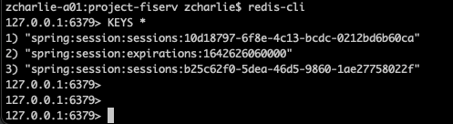

## Use Redis for HttpSession

```java
@EnableRedisHttpSession(maxInactiveIntervalInSeconds = 5)
```

```xml
<dependency>
    <groupId>org.springframework.session</groupId>
    <artifactId>spring-session-data-redis</artifactId>
</dependency>
```



## Benefit
1. High level way to use Redis for session control. Spring handles the Redis and session, we don't need to worry about anything.
2. The timeout is based on inactive idle time, so more accurate than hard-coding expiry-time with redisTemplate

## How to test
1. docker-compose up -d
2. Run test
3. Use redis-cli or redis-commander UI(http://localhost:8091/) to verify Redis data
